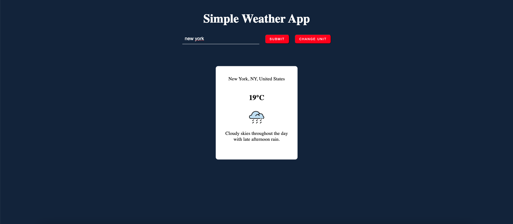

# The Odin Project - Weather App

### Javascript Course

Use everything we’ve been discussing to create a weather forecast site using the Visual Crossing API from previous lessons. You should be able to search for a specific location and toggle displaying the data in Fahrenheit or Celsius.

You should change the look of the page based on the data, maybe by changing the color of the background or by adding images that describe the weather. (You could even use the Giphy API to find appropriate weather-related gifs and display them). Feel free to use promises or async/await in your code, though you should try to become comfortable with both.

## Assignment

1. Set up a blank HTML document with the appropriate links to your JavaScript and CSS files.

2. Write the functions that hit the API. You’re going to want functions that can take a location and return the weather data for that location. For now, just console.log() the information.

3. Write the functions that process the JSON data you’re getting from the API and return an object with only the data you require for your app.

4. Set up a form that will let users input their location and will fetch the weather info (still just console.log() it).

5. Display the information on your webpage!

6. Add any styling you like!

7. Optional: add a ‘loading’ component that displays from the time the form is submitted until the information comes back from the API. Use DevTools to test for low-end devices.

8. Push that baby to github and share your solution below!

## Screenshots

